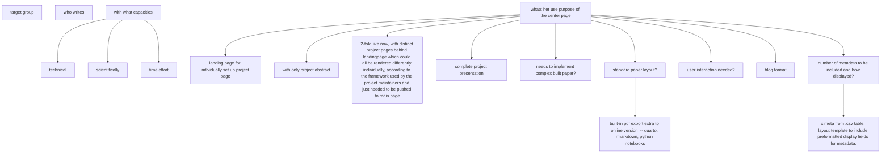

# Diagramme généré depuis input.md

## Source originale

- target group
- who writes
	- with what capacities
		- technical
		- scientifically
		- time effort
	- whats her use purpose of the center page
		- landing page for individually set up project page
			- with only project abstract
			- 2-fold like now, with distinct project pages behind landingpage which could all be rendered differently individually, according to the framework used by the project maintainers and just needed to be pushed to main page
		- complete project presentation
			- needs to implement complex built paper?
			- standard paper layout?
			  - built-in pdf export extra to online version  -- quarto, rmarkdown, python notebooks
		- user interaction needed?
			- blog format
		- number of metadata to be included and how displayed?
		  - x meta from .csv table, layout template to include preformatted display fields for metadata.